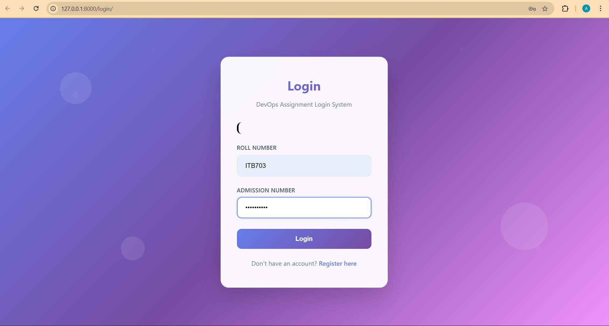
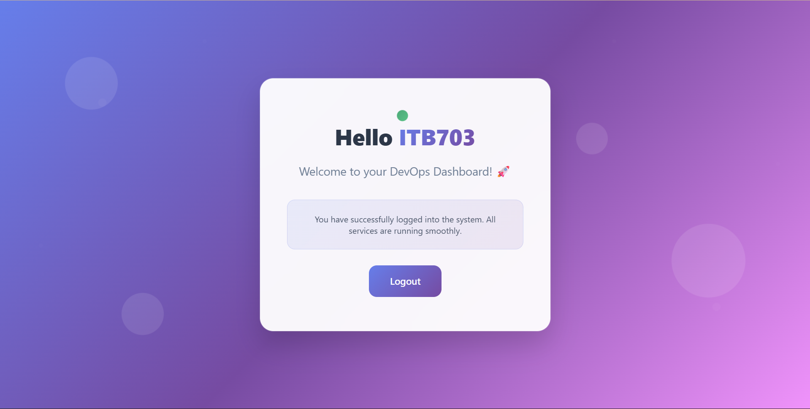

# DevOps Assignment - ITB703

## Infrastructure
- **Controller**: 44.193.223.96
- **Manager**: 34.230.229.232  
- **Worker A**: 13.218.252.195
- **Worker B**: 50.19.133.201

## Quick Start

### Bootstrap Everything:
```bash
chmod +x scripts/bootstrap.sh
./scripts/bootstrap.sh
```

### Access Points:
- **Application**: http://127.0.0.1:8000 (Local Development)
- **Docker Application**: http://localhost:8000 (Docker Compose)
- **Jenkins**: http://44.193.223.96:8080 (Production)

## Manual Deployment

### 1. Terraform:
```bash
cd terraform
terraform init
terraform apply
```

### 2. Ansible:
```bash
cd ansible
ansible-playbook -i inventory install-docker.yml
ansible-playbook -i inventory swarm-init.yml
ansible-playbook -i inventory deploy-stack.yml
```

## CI/CD Pipeline
Jenkins automatically builds and deploys on every push to ITB703 branch.

## Application Screenshots

### Login Page


*Modern glass morphism login interface with gradient background and floating animations*

### Home Dashboard  


*User dashboard with success indicators and modern UI design*

> **Note**: Screenshots show the modern UI with glass morphism design, gradient backgrounds, and floating animations. Upload your screenshots to the `screenshots/` folder to display them.


